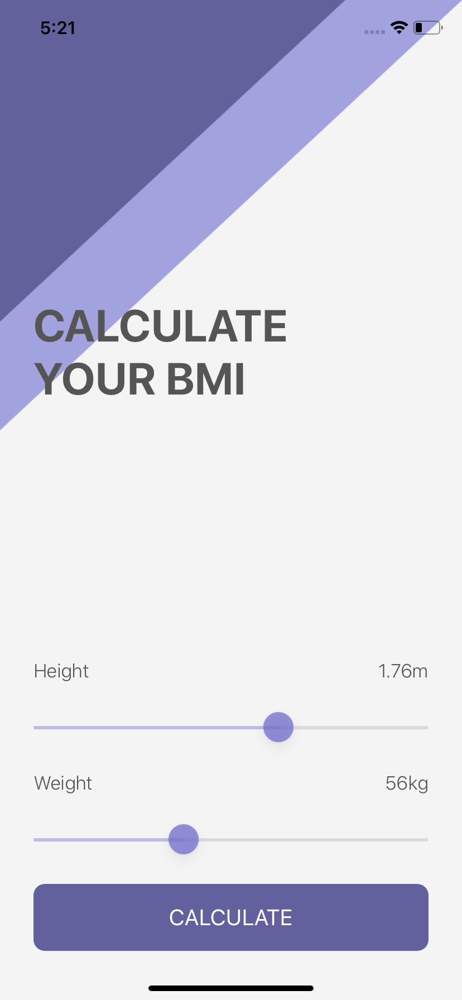
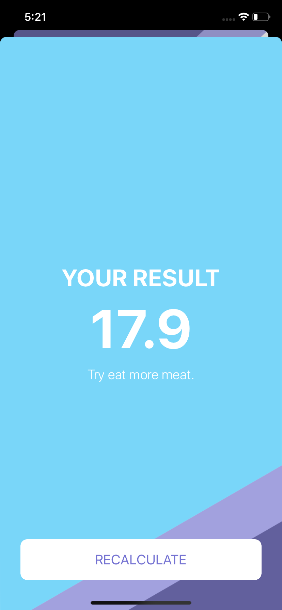

#  BMI Calculator

A Body Mass Index calculator based on the user’s weight and height. It will calculate their body mass and give a piece of health advice.

## Screenshots

## What I have learned

* How to create multi-screen apps with animated navigation.
* Optional binding, optional chaining and the nil coalescing operator.
* How to create classes and difference between classes and structs. 
* Pass by value vs. pass by reference. 
* Formatting Strings. 
* Color literals.

## Credits

>This is a companion project to The App Brewery's Complete App Development Bootcamp, full course at [www.appbrewery.co](https://www.appbrewery.co/)
